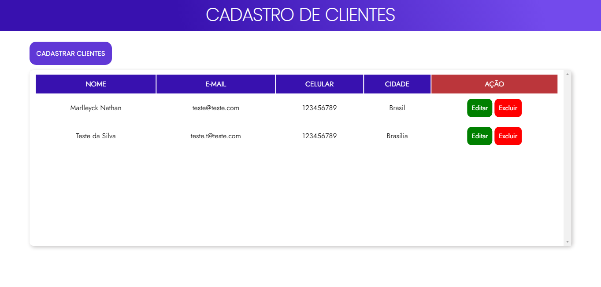

 
 <h1 align="center">CRUD-LS</h1>

 
 CRUD simples, usando HTML, CSS e JavaScript Vanilla. Utilizando como armazenamento de dados o LocalStorage.

 
<a href="https://marlleyck.github.io/CRUD-LS/" target="_blank">Acesse aqui</a>

 

